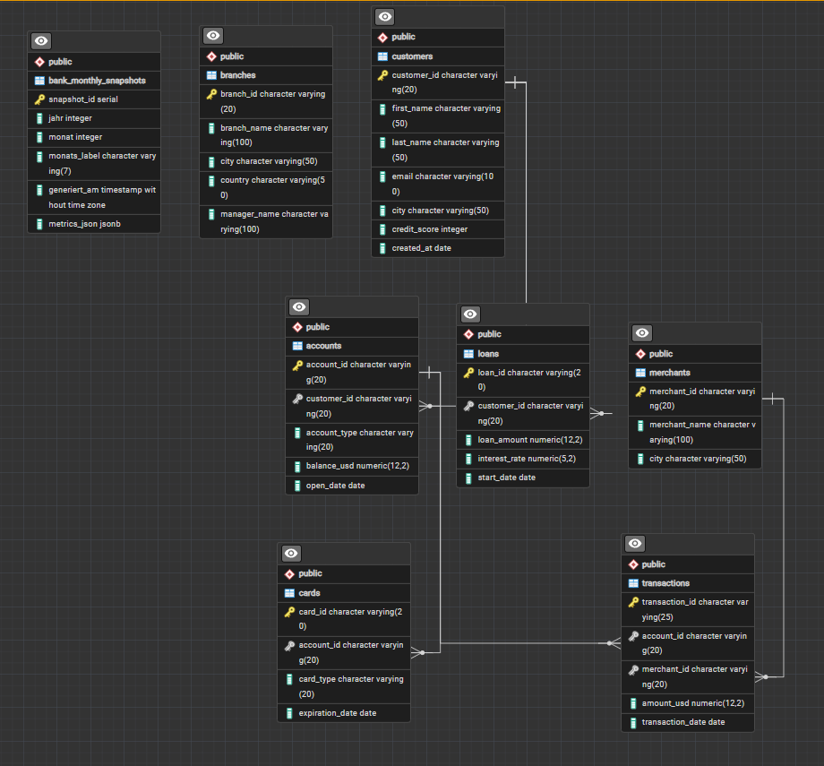

# 📊 Banking SQL Analytics

Analyse eines synthetischen Bankdatensatzes mit 1,26 Mio. Datensätzen zur praktischen Anwendung von SQL, relationaler Datenmodellierung, PostgreSQL, Exploratory Data Analysis (EDA) und Power BI. Dieses Projekt analysiert das Verhalten von Bankkunden auf Basis ihrer Kartennutzung (`Debit`, `Credit`, `Keine Karte`). Das Ziel ist es, Unterschiede im Kontostand, Transaktionsvolumen und Ausgabeverhalten zu identifizieren, um datengestützte Entscheidungen für Marketing und Produktentwicklung zu treffen.

---

## 📌 Inhaltsverzeichnis
- [Projektübersicht](#projektübersicht)
- [Wichtigste Erkenntnisse (Key Findings)](#wichtigste-erkenntnisse-key-findings)
- [SQL Analysen & Queries](#sql-analysen--queries)
  - [1. Haupt-Aggregation nach Kartentyp](#1-haupt-aggregation-nach-kartentyp)
  - [2. Transaktionsfrequenz pro Konto](#2-transaktionsfrequenz-pro-konto)
  - [3. Identifikation von High-Value-Kunden ohne Karte](#3-identifikation-von-high-value-kunden-ohne-karte)
  - [4. Volumen-Verteilung & Marktanteile](#4-volumen-verteilung--marktanteile)
- [Power BI Dashboard (Vorschau / Integration)](#power-bi-dashboard-vorschau--integration)
- [Nächste Schritte & Empfehlungen](#nächste-schritte--empfehlungen)

---

## 💡 Wichtigste Erkenntnisse (Key Findings)

* **Homogenes Ausgabeverhalten:** Der durchschnittliche Kontostand (~100.000 USD) und die durchschnittliche Einzeltransaktion (~5.000 USD) sind über alle Gruppen hinweg nahezu identisch. Der Kartentyp hat keinen Einfluss auf die Bonität oder die Höhe der einzelnen Transaktion.
* **Karten als Volumen-Treiber:** Kunden mit Kredit- oder Debitkarte generieren ein mehr als **2,5-fach höheres Gesamtvolumen** (~3,3 Mrd. USD) als Kunden ohne Karte (~1,3 Mrd. USD). Dies korreliert direkt mit der doppelt so hohen Kundenanzahl in den Kartengruppen.
* **Symmetrische Verteilung:** Debit- und Kreditkarten halten sich sowohl bei den Kontozahlen (ca. 36.500 Konten) als auch beim Gesamtvolumen exakt die Waage.

---
## Entity Relation Diagram

---

## 🛠️ SQL Analysen & Queries

Die folgenden SQL-Skripte wurden verwendet, um die Daten aufzubereiten und die Analysewerte zu generieren.

### 1. Haupt-Aggregation nach Kartentyp
Diese Abfrage erzeugt die primäre Übersichtstabelle über Konten, Salden und Transaktionsvolumina.

```sql
SELECT 
    COALESCE(c.card_type, 'Keine Karte') AS karten_typ,
    COUNT(DISTINCT a.account_id) AS anzahl_konten,
    ROUND(AVG(a.balance_usd), 2) AS avg_kontostand_usd,
    ROUND(COALESCE(SUM(t.amount_usd), 0), 2) AS gesamt_transaktionsvolumen_usd,
    ROUND(COALESCE(AVG(t.amount_usd), 0), 2) AS avg_einzeltransaktion_usd
FROM accounts a
LEFT JOIN cards c 
    ON a.account_id = c.account_id
LEFT JOIN transactions t 
    ON a.account_id = t.account_id
GROUP BY c.card_type
ORDER BY gesamt_transaktionsvolumen_usd DESC;


```
### 2.  Gesamtanzahl der Kunden & Kontenverteilung nach Kontotyp

```sql
SELECT 
    COUNT(DISTINCT c.customer_id) AS kunden_gesamt,
    COUNT(DISTINCT a.customer_id) AS kunden_mit_konto,
    (COUNT(DISTINCT c.customer_id) - COUNT(DISTINCT a.customer_id)) AS kunden_ohne_konto
FROM customers c
LEFT JOIN accounts a ON c.customer_id = a.customer_id;


```
### 3. Identifikation von High-Value-Kunden ohne Karte
Identifiziert kartenlose Kunden mit hohem Kontostand (> $100.000) für Upselling-Kampagnen:

```sql
SELECT 
     a.account_id,
     a.customer_id,
     a.balance_usd
FROM accounts a
LEFT JOIN cards c
    ON a.account_id = c.account_id
WHERE c.account_id IS NULL
  AND a.balance_usd >= 100000
ORDER BY a.balance_usd DESC;


```
### 4. Volumen-Verteilung & Marktanteile (Prozentual)
Berechnet den prozentualen Anteil am Gesamtumsatz pro Segment:


```sql
WITH SegmentStats AS (
    SELECT 
        COALESCE(c.card_type, 'Keine Karte') AS karten_typ,
        SUM(t.amount_usd) AS transaktion_volumen
    FROM accounts a
    LEFT JOIN cards c
        ON c.account_id = a.account_id
    LEFT JOIN transactions t
        ON a.account_id = t.account_id
    GROUP BY karten_typ
)
SELECT 
    karten_typ,
    transaktion_volumen,
    ROUND((transaktion_volumen / SUM(transaktion_volumen) OVER ()) * 100, 2) AS prozent_gesamtvolumen
FROM SegmentStats
ORDER BY transaktion_volumen DESC;

```
# 1. 📊 Power BI Dashboard (Vorschau & Ergebnisse)

(In Kürze verfügbar – Hier werden nach Fertigstellung des Power BI Dashboards die Ergebnisse visualisiert)


Geplante Visualisierungen:
KPI-Karten: Gesamtvolumen ($7,98 Mrd.), Aktive Konten (92.813), Avg. Transaktion ($5.000).

Donut-Chart: Marktanteil am Transaktionsvolumen nach karten_typ (Debit vs. Credit vs. Keine Karte).

Balkendiagramm: Vergleich der Kundenanzahl vs. Gesamtertrag je Segment.

Interactive Slicers: Filterung nach Region, Kundenalter und Konto-Erstellungsdatum.
